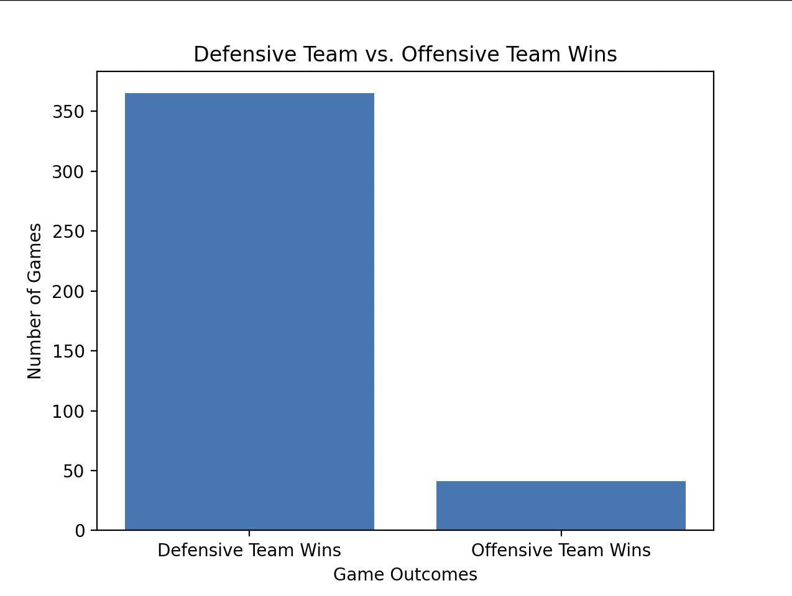
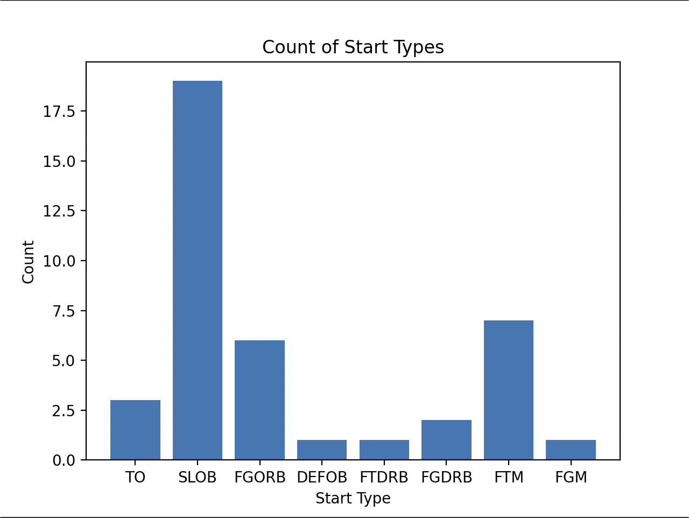
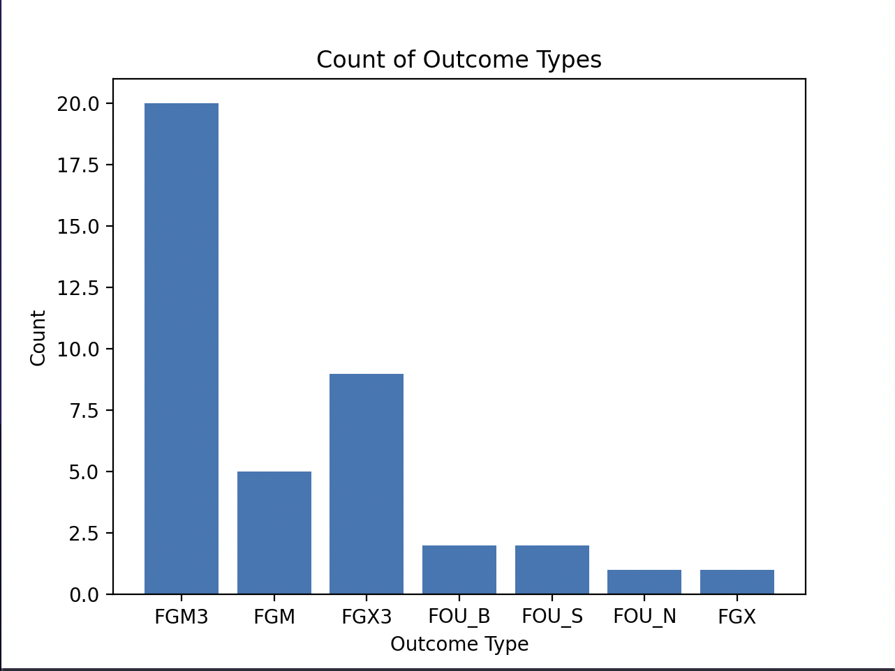

Situation:

- 4th Quarter
- Less than 24 seconds in the game
- Shot clock is off
- Up by 3
- We are on defense

In tackling this problem, there are a good amount of variables you need to consider when figuring out
whether the team should foul or not. In most scenarios with this situation, it is advisable to foul because
fouling will decrease the odds of the opposing team in making a three that could end up tying the game.

Here are some reasonings behind why fouling could be the best way to go:

The Clock and the Score are both in your favor:
By fouling intentionally, you are forcing the opposing team to rely on making both free throws, then making you turn the ball over and
if not fouling again and hoping you don't make both free throws, The odds of these events happening consecutively is low and are definitely less likely to occur than
the other team making an efficient three pointer.

Time Left:
When fouling when there is only a few seconds left on the clock, the odds of a team getting a shot off after getting fouled and then needing to get the ball back after
the free throws is slim, so fouling the offensive team can decrease the chances and time a team gets to make that shot even more

Shooting Prowess:
3-Pointer
If the defending team is guarding a team with a higher three point make percentage and are demonstrating that ability throughout that current game
then fouling will be much more effective to get them from even getting the opportunity to take that shot.
Free Throw Shooting
If the opposing team has weaker shooters and you can foul one if they get the ball, it reduces the likelihood of them scoring any of the free throws from the stripe.
Worst case scenario, if they sink both, they are still down by one but theres a good chance one or both will be missed, much better than giving the team the opportunity to
sink one beyond the arc

Amount of Timeouts remaining:
In the last 24 seconds, if a team has any timeouts remaining, they have the opportunity to take a timeout which will allow them to advance the ball to half-court giving
them a much better opportunity to score so fouling before then can call the timeout can definitely break their flow

Given the chances file given for this project, there is definitely some data that isn't provided that can assist in making a better judgment call

Player Specific Statistics:
With player data and performance statistics, we can analyze the 3 point percentages and free throw percentages of specific players on a team and can
provide a more accurate reading on which players the defensive team should foul and which the defensive team should think a little more about fouling.
With this information, a data visualization could be generated that can display the opposing teams overall and late game 3 point percentages and can
provide more confidence in the decision to foul or not

Timeouts Left:
Deciding to foul definitely is influenced by how many timeouts a team has left in the game. If a team does not have any timeouts left, they aren't
able to advance the ball but if they do they can put themselves in a better offensive position, draw up game winning plays and manage the clock accordingly
hence increasing their possibilities of scoring. Knowing this information is essential in determining if fouling should be considered.

Foul Situation:
Having information on if the offensive team is in the bonus can impact your decision to foul and send them to the line rather than letting them attempt a 3 pointer

Individual Foul Situation:
Being aware of if your key players are in foul trouble and in danger of fouling out, if the ball is passed to that player, you may not want to trade the player fouling out
for sending a player to the free throw line.

Late Game History:
Knowing the pure statistics on how successful the offensive team is in hitting that game tying shot and the defensive team in defending the offensive set properly can
help in determining the right decision. This decision will be based on actual game statistics and will provide factual information on the situation hence giving the defensive
team a better understanding on whether fouling is appropriate. With this, a data visualization can be generated depicting the teams general 3 point makes percentage over the course of their
late game/game deciding shot history (maybe a timeline of the last 2 seasons or under that specific coach) to see how likely they are to make the shot, this can be a chart or a shot chart on a half court graphic.

How Much Time is Left in the Half Court Setting:
We currently have data on when the possession starts and when the possession ends, but we don't necessarily have knowledge on how much time has passed since the start of the play.
Especially when there is only a few seconds on the clock and the offensive team hasn't taken the shot attempt, the defensive team can definitely foul later in the game clock to further limit
the offensive teams chance on scoring and tying purely based on time hence having this information can further allow the defensive team to make an accurate call.

Here is my thought process on what to analyze from the csv
I used python's csv library to parse through the file to obtain the information I wanted and then used matplotlib to plot what I wanted to portray from the data

First I just wanted to see how many of these scenarios have the offensive team winning versus when the defensive team wins. When there are 24 seconds left and the defensive team is up
by 3, in every predictable scenario the defensive team should win. The only way the offensive team wins if they execute late game offense/fouling/shot attempts to perfection.

Defensive Teams Wins vs Offensive Teams Wins:

As expected there are A LOT more defensive team wins than offensive team wins, specifically there are only around 39 offensive team wins in this sample size. Since its much more
likely that the offensive team loses, I feel that the best way to approach this question of fouling is to see when and how did the offensive team win? so I decided to look at what the start types and outcomes have looked like:

Start Types:

Outcome Types:

From these the Start Types, I just wanted to see which percent of the types started from a certain beginning, given that if a play starts from a common point across multiple instances, there could be more than meets the eye. With this, we could see that SLOB plays are easily the most common way that teams have found a way to win the game. When you do the math, 46.2% of
games won by the offensive team are won by SLOB which is not surprising and supports some of the statements made earlier in the project, therefore, its essential to foul the opponents before the other team has the opportunity to advance the ball

From the Outcome Types, I wanted to analyze how teams are coming out of the end of the game and diminishing the 3 point lead and going on to win the game. From the bar graph, its pretty interesting. Of the defensive teams that let the offensive team take their shot, 80% (20/25) of the wins came from shots that were attempted and made (I decided to not include the missed 3s or 2s because there is a need for more data as to what happened after the miss) while the remaining 5/25 were fouls that led to the win. With an 80-20 breakdown, I see a good amount of reason to foul when up by 3 points.

In Conclusion,
I think that there are definitely more to be done with this question of is fouling in this context necessary. But based on some of the analysis I was able to do, when giving the
offensive team the opportunity to draw up a play from the sideline for an inbounds play, there is a much greater chance that they can hit the three and tie the game, so in order to prevent that, intentionally fouling when there is just the right amount of time on the clock so that the other team can't take an efficient shot is essential in making sure they don't get the opportunity to make the game level.

This project was done using VSCode and Python on a Macbook Pro
